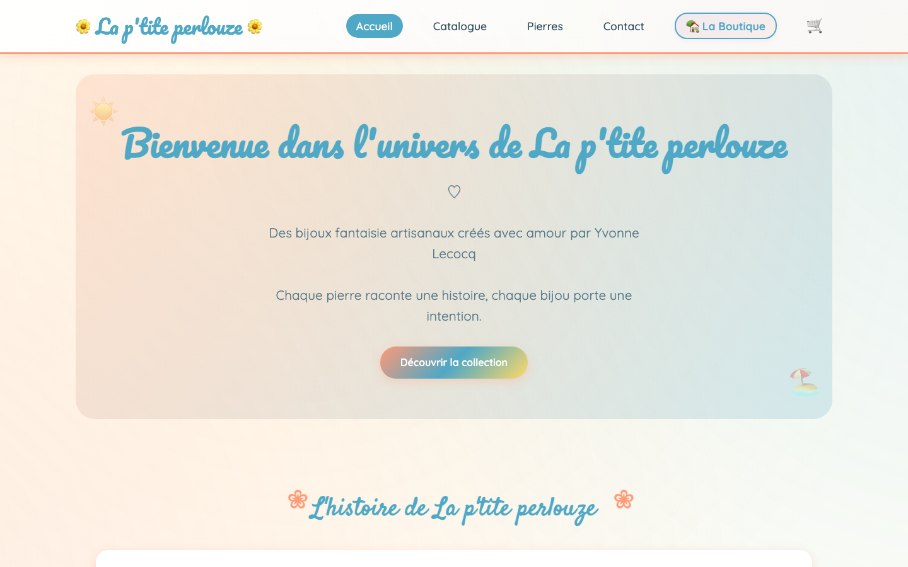

# La p'tite perlouze

Boutique en ligne réalisée pour une créatrice de bijoux fantaisie artisanaux en
pierres naturelles. Le besoin : vendre ses créations en direct, gérer seule son
catalogue et ses commandes, sans dépendre d'une plateforme tierce.

**Site en ligne :** <https://www.laptiteperlouze.fr/>

## Stack technique

- **Node.js** + **Express** (serveur et API REST)
- **Turso / libSQL** en production, **SQLite** en développement
- **HTML, CSS et JavaScript natifs** côté client, sans framework
- **Stripe** pour le paiement, **Resend** pour les emails transactionnels
- **Vercel Blob** + **Sharp** pour le stockage et l'optimisation des images
- **Helmet**, **express-rate-limit**, **bcrypt** et sessions par cookie pour la sécurité
- Déploiement **Vercel**

## Fonctionnalités

- Catalogue filtrable par catégorie, sous-catégorie et fourchette de prix, avec
  fiches produit détaillées et page dédiée aux pierres naturelles.
- Panier et tunnel de commande avec paiement en ligne via Stripe et calcul
  automatique des frais de livraison.
- Back-office protégé par authentification : gestion des produits, des images,
  des commandes, des messages de contact et des paramètres de la boutique.
- Emails automatiques de confirmation de commande et de prise de contact.
- Thèmes saisonniers et mode maintenance activables sans redéploiement de code.

## Déploiement

Hébergement sur **Vercel** (fonction serverless Node.js configurée dans
`vercel.json`), déploiement continu depuis la branche `main`. La base de données
est hébergée sur **Turso** et les images sur **Vercel Blob**. Toutes les clés et
identifiants proviennent des variables d'environnement Vercel (voir `.env.example`).
